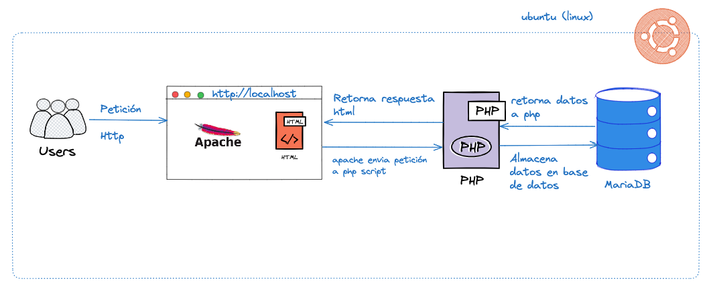
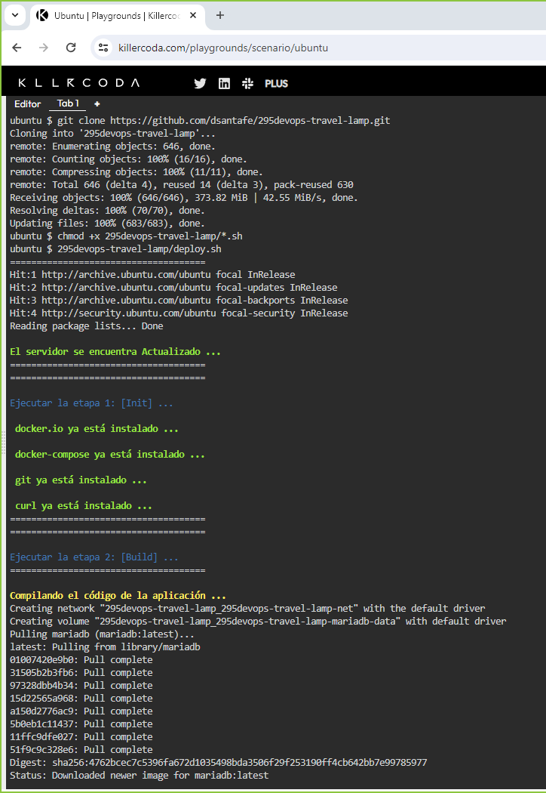
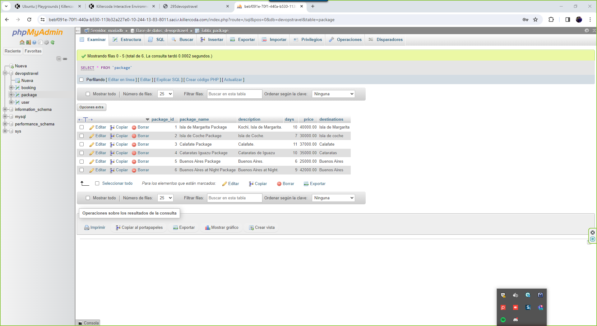
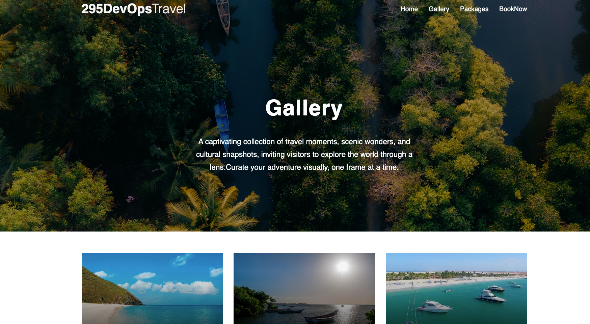
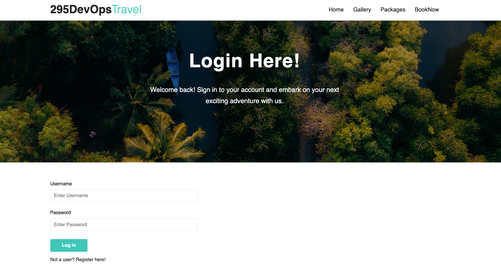
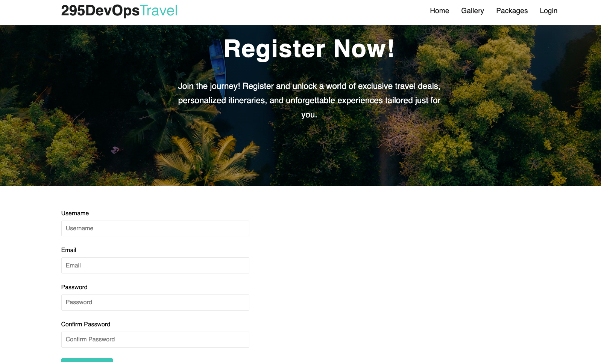
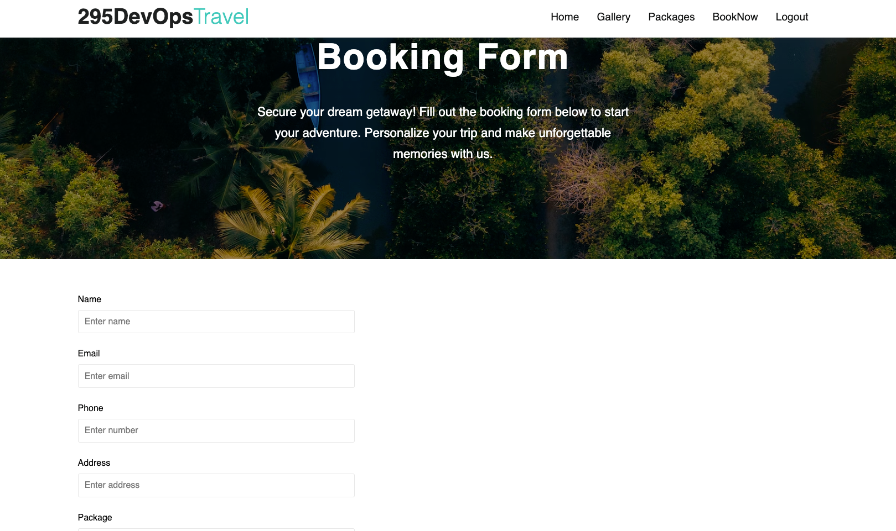
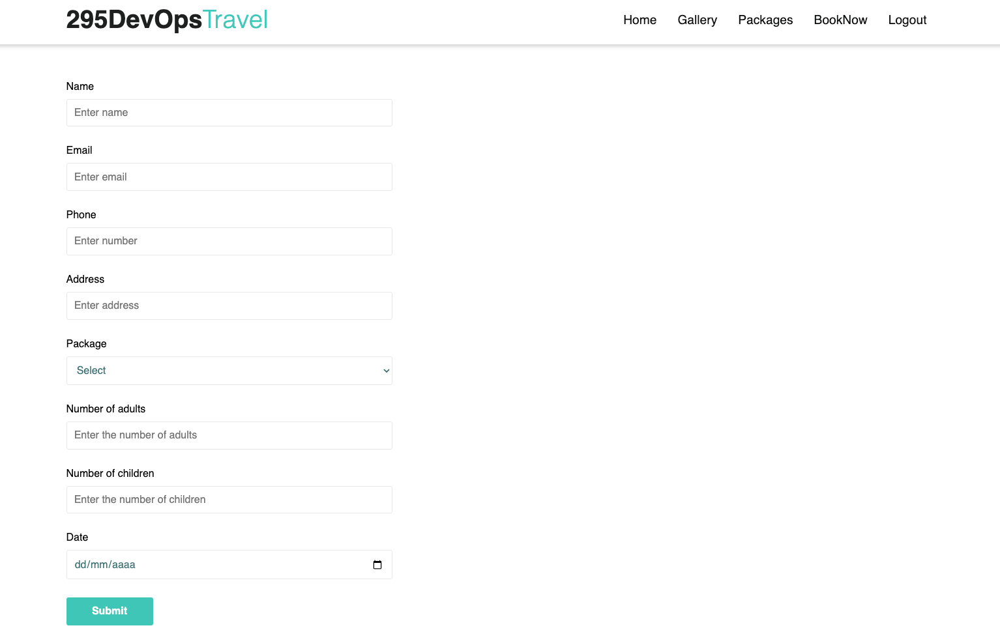
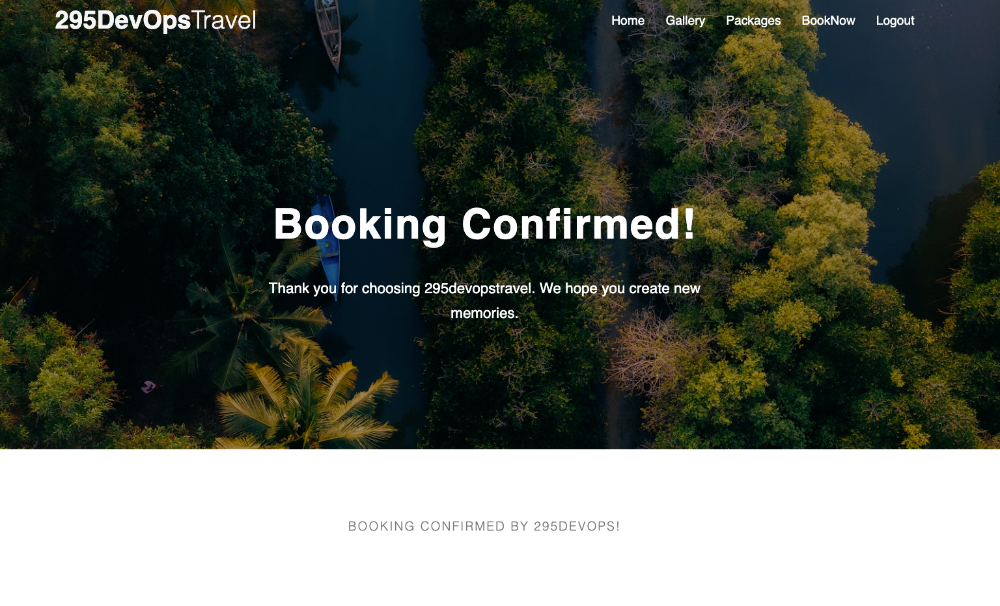
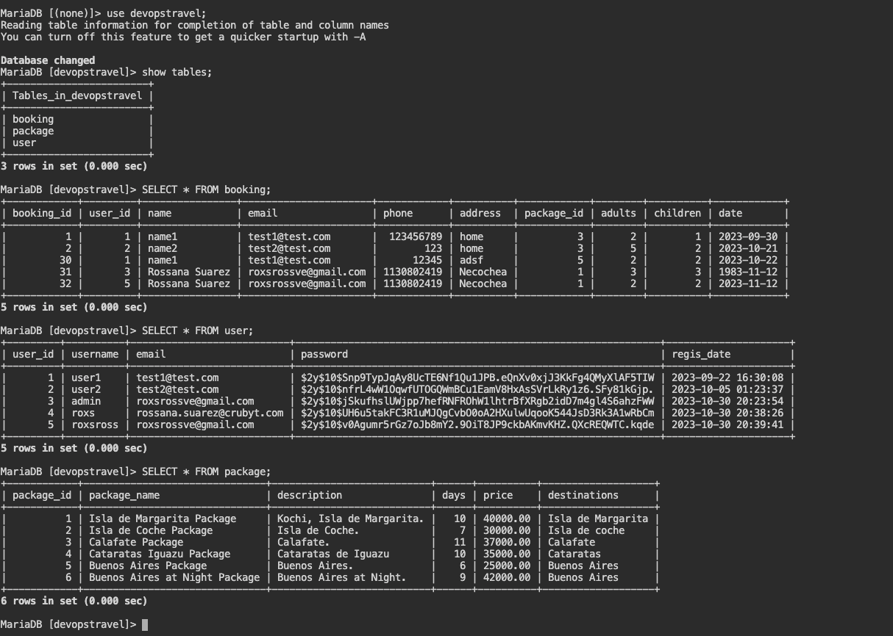

# Ejercicio-2 Desplegando Aplicaciones con Docker

- **295devops-travel**: En este ejercicio, tendrás la oportunidad de trabajar con una aplicación LAMP (Linux, Apache, MySQL, PHP) llamada "295devops-travel". Configura un servidor web Apache, una base de datos MySQL y la aplicación PHP, usando contenedores docker. Tu objetivo es lograr la automatización de implementación y despliegue.

# Ejercicio 2: "DevOps Travel Challenge: Elevando la LAMP a Nuevas Alturas con Docker"

Tu misión es llevar la aplicación "DevOps Travel" a un entorno moderno utilizando Docker y Docker Compose.

Esta aplicación es una LAMP (Linux, Apache, MySQL, PHP) stack que incluye PHP, Apache, y una base de datos MariaDB, gestionada a través de phpMyAdmin.

El objetivo es containerizar la aplicación, orquestar múltiples contenedores con Docker Compose, subir las imágenes resultantes a Docker Hub y automatizar todo el proceso con un script en bash.

### Recordando un poco como funciona la aplicación

- Los usuarios pueden reservar paquetes fácilmente a través de esta plataforma fácil de usar en la ubicación deseada.
- El sitio web front-end está creado utilizando HTML CSS y JavaScript.
- Este sitio web se hace flexible y responsivo.
- El Backend de este sitio web está realizado utilizando base de datos php y MySQL.
- El sitio web se ejecuta en el servidor Apache.

## Arquitectura de la Aplicación



En el diagrama de arquitectura, los usuarios inician una solicitud HTTP accediendo a la aplicación a través del navegador utilizando "localhost" o la dirección IP del servidor. El servidor, con Apache instalado, responde entregando el archivo a los usuarios, solicitándoles que completen sus datos, incluido su nombre, correo electrónico y descripción.

Al completar el formulario, los usuarios envían los datos al servidor. Luego, Apache reenvía los datos enviados a un script PHP responsable de almacenar esta información en la base de datos MySQL. Si los datos se almacenan correctamente, MySQL comunica este éxito al script PHP, que responde con un mensaje HTML que se muestra en el navegador del usuario. Por otro lado, si hay un problema al guardar los datos, el script PHP devuelve un mensaje de error al navegador del usuario, notificándole el problema encontrado.

Esta sólida arquitectura garantiza un flujo fluido de datos entre los usuarios, Apache, PHP y MySQL, proporcionando una experiencia de usuario fluida y una gestión de datos confiable.

### Realizar el desafío con Docker ofrece varios beneficios significativos, entre los cuales se incluyen:

- Portabilidad
- Aislamiento de Recursos
- Escalabilidad
- Consistencia
- Eficiencia en la Implementación
- Automatización
- Facilita la Colaboración
- Administración de Dependencias

Este repositorio contiene los archivos y comandos necesarios para desplegar la aplicación 295devops-travel con Docker

---

### Pasos del Desafío:

#### Containerización con Docker:

- Crea un Dockerfile para cada componente de la aplicación (PHP, Apache, MariaDB). Configura adecuadamente los servicios para trabajar juntos en un entorno Docker.

> Dentro del proyecto se encuentra su respectivo [Dockerfile](Dockerfile) con la configuración necesaria.
```yaml
FROM php:8.1-apache
COPY . /var/www/html
RUN sed -i "s/\$dbPassword = \".*\";/\$dbPassword = \"codepass\";/" /var/www/html/config.php && \
docker-php-ext-install mysqli && \
docker-php-ext-enable mysqli
EXPOSE 80
```

#### Docker Compose para multicontenedores:

- Crea un archivo docker-compose.yml que orqueste todos los contenedores necesarios para la aplicación DevOps Travel. Asegúrate de que los servicios se conecten entre sí y que phpMyAdmin pueda gestionar la base de datos.

> Despliegue de la aplicación con [Docker Compose](docker-compose.yml)
```bash
$ docker-compose -p 295devops-travel-lamp --env-file .env.dev up -d --build
$ docker ps
```

#### Subida a Docker Hub:

- Crea una cuenta en Docker Hub si no la tienes.
- Construye las imágenes Docker de tu aplicación y súbelas a Docker Hub.
- Utiliza versiones semánticas para etiquetar tus imágenes.

> [GitHub Actions - Backend Build and Publish](/.github/workflows/travel-front-docker-publish.yml)

#### Script Bash de Automatización:

- Crea un script bash llamado deploy.sh que automatice el proceso completo.
- El script debe incluir pasos para construir cada imagen, etiquetarlas, subirlas a Docker Hub y luego ejecutar Docker Compose.
- Ademas debes validar si la imagen que se subio a docker hub es la misma y no dejarlo avanzar recueden las imagenes deben ser inmutables
- Implementa manejo de versiones semánticas en el script.

> Despliegue de la aplicación con [Script Bash](deploy.sh)
```bash
$ git clone https://github.com/dsantafe/295devops-travel-lamp.git
$ chmod +x 295devops-travel-lamp/*.sh
$ 295devops-travel-lamp/deploy.sh 
```

- Ingrese el host de la aplicación: <host_url>
- Ingrese el token de acceso de tu bot de Discord: <token_discord>

### Resultados

1. Ejecución del Script Bash



2. Pruebas phpmyadmin



### Vistas










# Links
- Config repo: https://github.com/dsantafe/295devops-travel-lamp
- Killercoda Interactive Environments: https://killercoda.com/